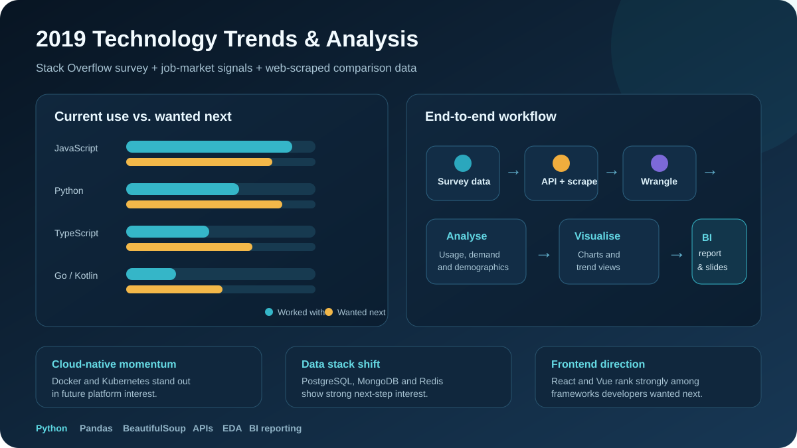

# 2019 Technology Trends & Analysis

An end-to-end data analysis project using the **2019 Stack Overflow Developer Survey** to compare the technologies developers were using at the time with the technologies they wanted to learn next.

I also added two external signals — a historical **GitHub Jobs API** snapshot and a small **web-scraped programming-language dataset** — to make the analysis more useful than a single-source survey report.



## What this project is about

Technology changes quickly, so current popularity on its own does not tell the full story. A language, framework or platform can be widely used today while another tool is gaining interest faster for the future.

This project looks at both sides:

- what developers were already using in 2019
- what they wanted to use or learn next
- how those patterns differed across languages, databases, platforms and web frameworks
- whether survey trends broadly matched job-market and web-scraped signals
- what the respondent demographics looked like

The final output is a **BI-style technology trends report** supported by the full analysis workflow in Python notebooks.

---

## End-to-end workflow

| Stage | What I did | Main tools |
|---|---|---|
| 1. Data collection | Pulled job-market data through an API and collected a small comparison dataset through web scraping | Python, Requests, BeautifulSoup |
| 2. Data understanding | Reviewed dataset shape, data types, duplicates and missing values | Pandas, Jupyter |
| 3. Data wrangling | Removed duplicates, handled missing data and prepared multi-response technology fields for analysis | Pandas, NumPy |
| 4. Exploratory analysis | Compared current technology usage, future interest and respondent demographics | Pandas, SQL/SQLite |
| 5. Visualisation | Built charts to make the main trends easier to compare | Matplotlib, Seaborn |
| 6. BI reporting | Turned the analysis into a concise presentation/report for a non-technical audience | Data storytelling, BI reporting |

---

## Data sources

### 1. Stack Overflow Developer Survey 2019

The core analysis uses a cleaned subset of the 2019 survey containing:

- technologies respondents had worked with
- technologies respondents wanted to work with next
- programming languages
- databases
- platforms
- web frameworks
- respondent demographics such as age, gender, education and country

Main files:

- [`Dataset/m5_survey_data_technologies_normalised.csv`](Dataset/m5_survey_data_technologies_normalised.csv)
- [`Dataset/m5_survey_data_demographics.csv`](Dataset/m5_survey_data_demographics.csv)
- [`Dataset/m4_survey_data.sqlite.zip`](Dataset/m4_survey_data.sqlite.zip)

### 2. GitHub Jobs API snapshot

A historical job-market snapshot was used to count technology mentions in job listings and provide a second signal alongside survey popularity.

### 3. Web-scraped language data

A small public webpage was scraped to collect a comparison list of popular programming languages. This part of the project demonstrates a basic scrape → clean → save workflow.

---

## Project notebooks

The notebooks are arranged in the same order as the analysis pipeline.

### 1. Collect job data using an API

[`notebooks/1. Collecting_job_data_using_APIs.ipynb`](notebooks/1.%20Collecting_job_data_using_APIs.ipynb)

- requests job-listing data
- counts technology mentions
- saves the results for later comparison

### 2. Web scraping

[`notebooks/2a. Web_Scraping.ipynb`](notebooks/2a.%20Web_Scraping.ipynb)

- extracts programming-language data from a webpage
- structures the results
- exports the cleaned output

### 3. Explore the survey data

[`notebooks/2b. Explore_Dataset.ipynb`](notebooks/2b.%20Explore_Dataset.ipynb)

- checks the structure of the dataset
- reviews missing values and duplicates
- inspects the available fields before analysis

### 4. Data wrangling

[`notebooks/3. Data_Wrangling.ipynb`](notebooks/3.%20Data_Wrangling.ipynb)

- removes duplicates
- handles missing values
- prepares the technology fields for analysis

### 5. Exploratory data analysis

[`notebooks/4. Exploratory_Data_Analysis.ipynb`](notebooks/4.%20Exploratory_Data_Analysis.ipynb)

- compares technologies developers had worked with
- compares technologies developers wanted next
- analyses demographic patterns

### 6. Data visualisation and reporting

[`notebooks/5. Data_Visualization.ipynb`](notebooks/5.%20Data_Visualization.ipynb)

- creates the charts used in the final analysis
- turns the findings into a clear story for a business audience

Final deliverables:

- [`docs/Technology Trends & Analysis Presentation.pptx`](docs/Technology%20Trends%20%26%20Analysis%20Presentation.pptx)
- [`docs/Technology Trends & Analysis Presentation.pdf`](docs/Technology%20Trends%20%26%20Analysis%20Presentation.pdf)

---

## Key findings

### Programming languages

JavaScript, HTML/CSS and SQL were among the most widely used technologies in the survey subset.

The future-interest view was more interesting. **Python, TypeScript, Go and Kotlin** showed strong interest relative to their current-use position, suggesting developers were actively looking beyond the most established languages.

### Databases

MySQL and Microsoft SQL Server were highly represented in current usage, while **PostgreSQL, MongoDB and Redis** ranked strongly in the technologies respondents wanted to use next.

That points to growing interest in modern relational, document and in-memory data tools rather than simply repeating the existing market order.

### Platforms

Linux and Windows were widely used, but **Docker, AWS and Kubernetes** stood out in future interest.

The gap between current use and wanted-next use gives a clearer picture of where cloud-native development was heading than a simple popularity ranking would.

### Web frameworks

jQuery and Angular had strong current usage, while **React and Vue** performed particularly well in the future-interest view.

This is a good example of why the project compares current adoption with future intent instead of treating them as the same thing.

### Demographics

The survey subset was heavily male, with an average respondent age of roughly 31 and a median of 29. The United States, India, the United Kingdom, Germany and Canada were among the most represented countries.

---

## Skills demonstrated

This project covers more than chart building. It shows the full path from raw data to a stakeholder-facing output:

- Python data analysis
- Pandas and NumPy
- API data collection
- web scraping with BeautifulSoup
- SQLite / SQL
- data cleaning and wrangling
- exploratory data analysis
- data visualisation
- BI reporting
- data storytelling
- translating technical findings for a non-technical audience

---

## Repository structure

```text
2019_Technology_Trends-Analysis/
│
├── Dataset/
│   ├── survey technology data
│   ├── demographic data
│   └── SQLite dataset
│
├── notebooks/
│   ├── 1. Collecting_job_data_using_APIs.ipynb
│   ├── 2a. Web_Scraping.ipynb
│   ├── 2b. Explore_Dataset.ipynb
│   ├── 3. Data_Wrangling.ipynb
│   ├── 4. Exploratory_Data_Analysis.ipynb
│   └── 5. Data_Visualization.ipynb
│
├── docs/
│   ├── Technology Trends & Analysis Presentation.pptx
│   └── Technology Trends & Analysis Presentation.pdf
│
├── images/
│   └── technology-trends-thumbnail.svg
│
└── readme.md
```

---

## How to run the analysis

The project is notebook-based, so the easiest option is JupyterLab or VS Code.

Install the main Python libraries:

```bash
pip install pandas numpy matplotlib seaborn requests beautifulsoup4
```

Then open the notebooks in numerical order, starting with the collection steps and ending with the visualisation notebook.

Some external data sources used in the original project were point-in-time sources, so the API or scraped page may not behave exactly as it did when the analysis was first created. The survey datasets stored in the repository can still be used to reproduce the main analysis.

---

## What I would improve next

If I extended this project, I would:

- add later Stack Overflow survey years to measure how accurate the 2019 future-interest signals were
- automate the survey cleaning process into a reusable Python pipeline
- compare survey popularity and job demand using a more formal scoring method
- segment the analysis by job role, experience level or country
- publish the final report as a live Power BI, Tableau or web dashboard

---

## Why this project matters in my portfolio

The useful part of this project is not the 2019 ranking itself. It is the workflow.

It shows that I can take data from different sources, clean and structure it, investigate the important questions, produce clear visualisations and then turn the result into something a stakeholder can actually read and use.

---

## Author

**Yasir Savanur**

[LinkedIn](https://www.linkedin.com/in/yasir-savanur/) | [Portfolio](https://yasirsavanur.github.io/)
